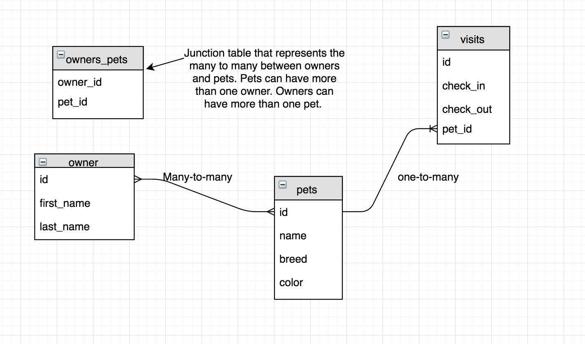

# Multi Table Pet Hotel
Your client is loving the work you did for them to build their pet hotel app. They want to add the additional functionality to track pet visits to the hotel (hard mode) and pet owners (pro mode). This will give you the ability to try your new sql **JOINs** chops. They have an additional requirement, they want you to use **Angular** for the front end. 

## Base Mode
Refactor the pet hotel app to use angular. You are in new groups this week, so pick a group members project that completed base mode last week. Spend some time getting the group up to speed on the code. This is good practice for having to read other peoples code on the job.

Make a branch and begin the Angular refactor on it. 

## Hard Mode
Add the ability to track pet visits.

- As shown in the ERD below, this is a 1-M relationship.
- When creating a new 'visit' you should connect it to the pet w/a drop down menu of current pets in the db.
- You can be creative with how you lay this out, but find a way to show all pets and their visits. This could be in two different areas of the DOM or all in one place. 

**NOTE:** _For this database change, start by changing the schema. You can drop all tables and re-create them. Then think about the routes that you have that will need to change and the new routes that you will need to create. Start one route at a time. Go slow, this is hard stuff, ask questions and be patient with yourself._

## Pro Mode
Ability to create an owner.
- As shown in the ERD, this is a M-M relationship.
- Add the ability to create an owner.
- Add the ability to create a pet and associate them to their owner via a drop down populated via the database owner table.

## Database Schema
Only look at the parts of this that are relevant to the mode you are currently working on.

Create these tables locally. Then update your `database.sql` file in your repo with the new schema CREATE TABLE syntax you used.

## Mock up
Possible mock up for how this could look: [https://drive.google.com/file/d/0B10Wu-zrSBwMZ1E0Y2ZYazVXdlE/view](https://drive.google.com/file/d/0B10Wu-zrSBwMZ1E0Y2ZYazVXdlE/view)